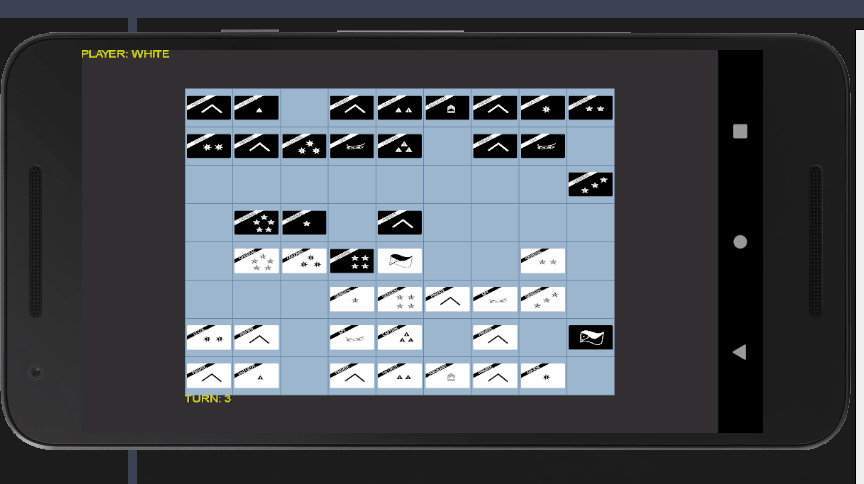
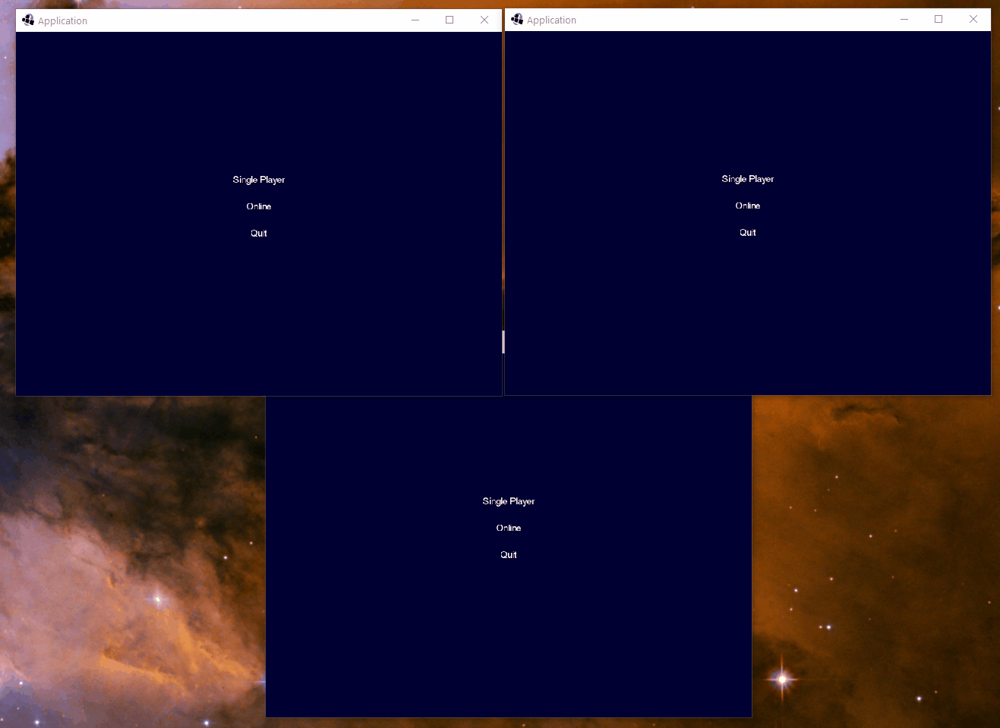

# Game of Generals 2.0

Version 2.0 [LibGDX](https://libgdx.badlogicgames.com/) re-write of
[java-game-of-generals](https://github.com/marklcrns/java-game-of-generals)

## Current State of the Game

### 2020-10-19

### 2020-11-24

### 2021-01-17

## Resources

- [Creating Multiplayer Games with LibGDX and NodeJS](https://www.youtube.com/watch?v=uIPAaDslhPM&list=PLZm85UZQLd2Qh6r7jxBKPuB4hl-Xw5uZT)
- [MIT 6.034 Artificial Intelligence, Fall 2010](https://www.youtube.com/watch?v=TjZBTDzGeGg&list=PLUl4u3cNGP63gFHB6xb-kVBiQHYe_4hSi)

## TODO

- [X] Implement screens
    - [X] Splash screen
    - [X] Loading screen
    - [X] Main menu screen
    - [X] Game screen
- [X] Implement game engine
- [X] Implement game ui
- [X] Implement game modes
    - [X] Single player
    - [X] Online multiplayer
        - [X] Temporary Socket Server with socket.io for development
    - [ ] Training mode
- [ ] Implement AI
    - [X] Implement dumb AI
    - [ ] Implement minimax AI
        - [ ] Implement minimax algorithm with an imperfect information (does not
        collect true piece engagement evaluation)
        - [ ] Implement AI debugger window
        - [ ] Fix game synchronicity
            - [ ] Wait for stage Actor actions to finish before relaxing turn
- [ ] Improve game performance
- [ ] Implement JUnit 5 tests on critical classes
- [ ] Add in-game visual fx
- [ ] Improve game UI
- [ ] Implement player profiling
- [ ] Implement game leaderboard
- [ ] Set up game server
    - [ ] Implement online multiplayer lobby
- [ ] Launch game in PlayStore

