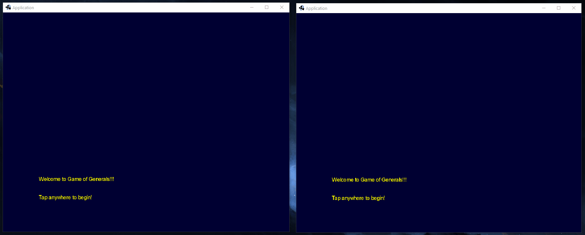

# Game of Generals 2.0

Version 2.0 [LibGDX](https://libgdx.badlogicgames.com/) re-write of
[java-game-of-generals](https://github.com/marklcrns/java-game-of-generals)

## Current State of the Game

### 2020-10-19

### 2020-11-01

### 2020-11-24

## Resources

- [Creating Multiplayer Games with LibGDX and NodeJS](https://www.youtube.com/watch?v=uIPAaDslhPM&list=PLZm85UZQLd2Qh6r7jxBKPuB4hl-Xw5uZT)
